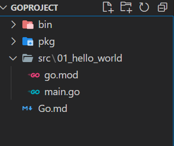
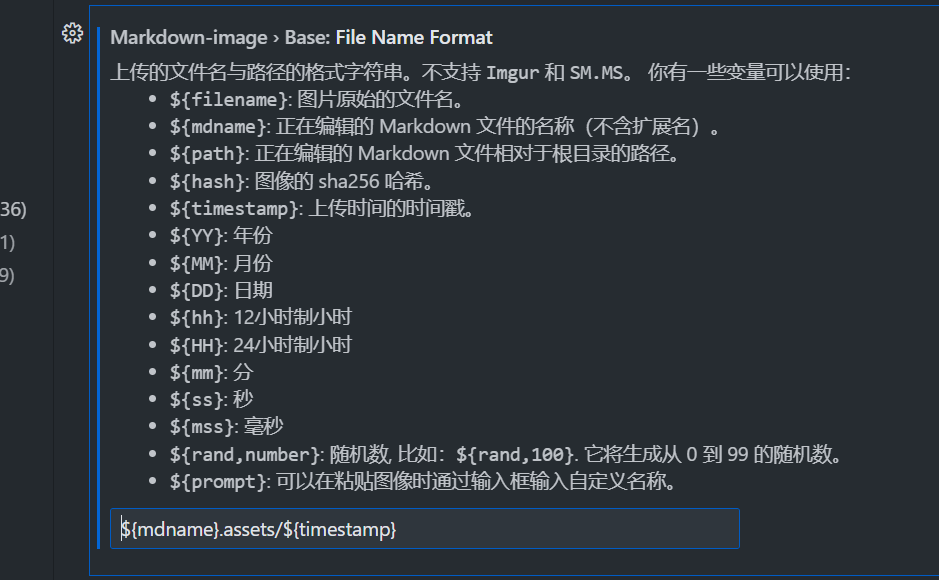
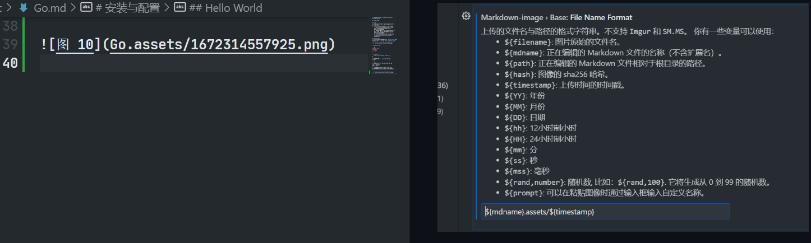

[参考文档](https://learnku.com/docs/the-way-to-go)

# 安装与配置

## 安装
1. [Go 官网](https://golang.google.cn/dl/)下载版本
2. 配置环境变量与代码文件位置环境变量
   1. [Go工程创建与管理](https://blog.csdn.net/gty204625782/article/details/124067779)
   2. VSCode配置环境 [异常解决](https://blog.csdn.net/qq_40374604/article/details/125757409)
   3. [配置插件问题](https://blog.csdn.net/qq_42119514/article/details/118307558)

## Hello World
* 创建相关的三个包之后创建 `hello_world`工程目录，进入执行`go mod init "project_name"`

  

* 创建`main.go`

```go
package main
import (
	"fmt"
)

func main()  {
	fmt.Println("Hello World!");
}
```
* 该文件路径执行 `go run main.go`
* 输出

```sh
D:\goproject\src\01_hello_world> go run .\main.go
Hello World!
```
* [导包失败](https://blog.csdn.net/qq_40586108/article/details/121430216)


  
  
